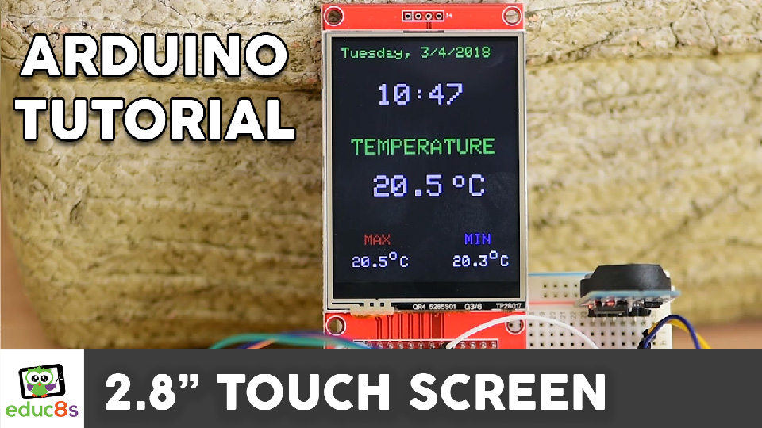

# Arduino ILI9341 Examples

Arduino ILI9341 Examples

# Video Tutorial

  

🎥 <a href="https://www.youtube.com/watch?v=beyDkTBhpgs">Video Tutorial on YouTube</a>

 
 

| 📺 <a href="https://www.youtube.com/educ8s">YouTube</a>
| 🌍 <a href="http://www.educ8s.tv">Website</a> |  

# Parts Needed

🛒 2.8″ Inch Display ▶ https://educ8s.tv/part/28ILI9341

🛒 Arduino Uno ▶ https://educ8s.tv/part/ArduinoUno

🛒 Resistors ▶ https://educ8s.tv/part/Resistors

🛒 Arduino Pro Mini ▶ https://educ8s.tv/part/ArduinoProMini

🛒 ESP32 ▶ https://educ8s.tv/part/ESP32

🛒 STM32 ▶ https://educ8s.tv/part/STM32

🛒 DS3231 RTC ▶ https://educ8s.tv/part/DS3231

🛒 Breadboard ▶ https://educ8s.tv/part/SmallBreadboard

🛒 Wires ▶ https://educ8s.tv/part/Wires

💖 Full disclosure: All of the links above are affiliate links. I get a small percentage of each sale they generate. Thank you for your support!

